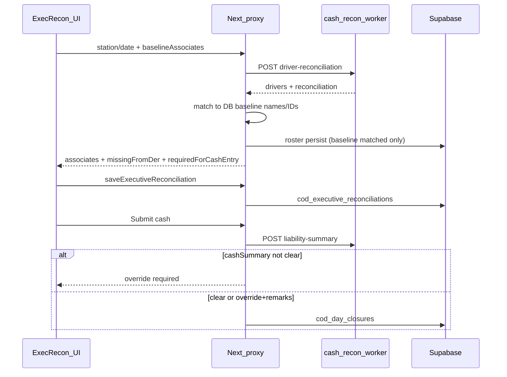

# Cash-recon worker → Executive Reconciliation (Production Port Guide)

**Audience:** Codex / coding agent implementing this in production  
**Target repo:** [nisar-dropx/dropx-partner-dashboard](https://github.com/nisar-dropx/dropx-partner-dashboard) — especially [`src/app/ops-pulse`](https://github.com/nisar-dropx/dropx-partner-dashboard/tree/main/src/app/ops-pulse)  
**Reference implementation:** local `dropx-ops-pulse` (this workspace) — copy patterns, do not invent a parallel architecture  
**Worker:** Cloudflare Worker `https://cash-recon-worker.aj13peace.workers.dev` (repo: `DROPX-LOGISTICS/ops-worker`)  
**Out of scope for this PR:** remittance API UI, full replacement of deposit portal worker, redesign of Steps 2–3 beyond liability gate  
**Status:** Reference implementation complete in `dropx-ops-pulse`. Use this doc as the production port checklist.

---

## 1. Goal (what “done” looks like)

On **Executive Reconciliation** (`/ops-pulse/cod/executive-reconciliation` and clean ops host `/cod/executive-reconciliation`):

1. **Station / date change** auto-calls worker via Next proxy `POST /api/ops-pulse/cod/cash-recon/driver-reconciliation` (which calls worker `POST /api/admin/executive/driver-reconciliation`).
2. **Collect cash** dropdown shows **only shipment DB associates** (`source === "shipment_data"`), not cash-recon roster rows.
3. Collect labels prefer full worker `drivers.driverName` when matched (e.g. `Shiva Yadav / DROP / 207546749`). Do **not** strip at `/` for Collect / Missing DER labels. (`executiveDisplayName` strips at `/` — **do not** use it for Collect options.)
4. Collect save keys use **DB** `provider_employee_id` (shipment employee id).
5. Expected COD comes from worker `paymentInfo.expected.value` after matching DB row → driver/recon by `employeeId` / `tasId` / name.
6. If `overallPendingRecon.value > 0` → modal with breakdown + manual override (remarks required) before denominations unlock.
7. Editing expected → remarks required.
8. **Missing from DER** = API `missingFromDer` (worker drivers/recon **not** on the DB list) + **Other**. Use the proxy response as source of truth — do **not** rebuild Missing DER with fuzzy client matching (that drops / shortens names).
9. Missing DER **select/save id** = numeric `employeeId` when present (e.g. `2000080619110`), **not** `tasId` (e.g. `A1OJVT0C5WK65I`). Fall back to tasId only if employeeId is missing.
10. Missing DER **display name** = full `drivers.driverName`. Resolve via `reconciliation[].driverInfo.id` → `drivers[].tasId` → `driverName`. Never show short `driverInfo.name` alone when a driver row exists.
11. **Continue to driver validation** stays visually muted until **every** cash-recon associate with `paymentInfo.expected.value > 0` has a saved cash entry (match by `provider_employee_id` / name). Button stays clickable and opens a modal listing remaining drivers.
12. **Submit cash & run SCC** first checks `POST /api/admin/executive/liability-summary` (via Next proxy).
13. Gate **only on cashSummary** (all ~0). **Ignore MPOS.** Ignore worker `check.passed` for blocking.
14. Admin key **never** sent to the browser — only Next server routes/actions call the worker.

---

## 2. Environment (production)

Add to production secrets / `.env` (never commit real keys):

```bash
CASH_RECON_WORKER_URL=https://cash-recon-worker.aj13peace.workers.dev
CASH_RECON_ADMIN_KEY=<ADMIN_API_KEY>   # same value as worker x-admin-key / X_ADMIN_KEY
```

Fallback allowed in code: `CASH_RECON_ADMIN_KEY || X_ADMIN_KEY`.

Worker auth header: `x-admin-key: <CASH_RECON_ADMIN_KEY>`.

---

## 3. Worker APIs (contract)

All requests: `POST`, `Content-Type: application/json`, header `x-admin-key`.

### 3.1 Driver reconciliation (load on station/date)

`POST {CASH_RECON_WORKER_URL}/api/admin/executive/driver-reconciliation`

```json
{ "stationCode": "JDBD", "date": "2026-08-02" }
```

Response (relevant fields):

```json
{
  "status": "ok",
  "stationCode": "JDBD",
  "date": "2026-08-02",
  "sessionSource": "cached",
  "drivers": [
    {
      "driverName": "Raj Kapoor / DROP / 208095102",
      "employeeId": 2000080619110,
      "store": false,
      "tasId": "A1OJVT0C5WK65I"
    }
  ],
  "driverCount": 31,
  "reconciliation": [
    {
      "store": false,
      "driverInfo": { "name": "Prakash Thakur", "id": "ALIY31TUBQNTG" },
      "paymentInfo": {
        "expected": { "unit": "INR", "value": 21523 },
        "overallPendingRecon": { "unit": "INR", "value": 0 },
        "overallPendingReconBreakdownList": []
      }
    }
  ],
  "reconciliationCount": 17
}
```

**ID map (critical):**

| Field | Meaning | Use for |
| --- | --- | --- |
| `drivers[].employeeId` | Amazon / provider employee id (numeric) | Collect match to DB; Missing DER save id |
| `drivers[].tasId` | TAS id | Match to `reconciliation[].driverInfo.id` |
| `drivers[].driverName` | Full label `Name / DROP / …` | Collect + Missing DER display |
| `driverInfo.name` | Short name only | Matching fallback only — not UI label when driverName exists |
| `driverInfo.id` | Same as `tasId` | Join recon → drivers |

Pending example fields when blocked:

- `paymentInfo.overallPendingRecon.value` > 0  
- `paymentInfo.overallPendingReconBreakdownList[]`: `trackingId`, `paymentMethod`, `moneyCollectionTime`, `amount.value`, `stationTimeZone`

### 3.1b Next proxy response (what the UI consumes)

`POST /api/ops-pulse/cod/cash-recon/driver-reconciliation`

Browser body:

```json
{
  "stationCode": "JDBD",
  "date": "2026-08-02",
  "locationId": "<uuid>",
  "baselineAssociates": [
    { "providerEmployeeId": "2000079399605", "name": "Shiva Yadav / DROP / 207546749" }
  ]
}
```

Normalized JSON (in addition to raw `drivers` / `reconciliation`):

```json
{
  "associates": [],
  "missingFromDer": [
    {
      "providerEmployeeId": "2000080619110",
      "name": "Raj Kapoor / DROP / 208095102",
      "displayName": "Raj Kapoor / DROP / 208095102",
      "employeeId": "2000080619110",
      "expected": 0,
      "pendingRecon": 0,
      "breakdown": [],
      "source": "extra",
      "shipmentType": "Cash recon worker"
    },
    { "providerEmployeeId": "__other__", "name": "Other", "source": "other" }
  ],
  "requiredForCashEntry": [],
  "drivers": [],
  "reconciliation": [],
  "sessionSource": "cached"
}
```

**UI rule:** Missing DER panel maps `missingFromDer` from this response (prefer `employeeId` as select value). Collect cash stays the page’s DB list, enriched with expected/pending/full name from `associates` + `drivers`.

### 3.2 Liability summary (before submit)

`POST {CASH_RECON_WORKER_URL}/api/admin/executive/liability-summary`

```json
{ "stationCode": "JDBD", "date": "2026-08-02" }
```

**Pass condition (ONLY this):**

```text
cashSummary.expectedAmount ≈ 0
AND cashSummary.actualAmount ≈ 0
AND cashSummary.shortExcessAmount ≈ 0
AND cashSummary.count ≈ 0
(epsilon 0.01)
```

**Do not block on:**

- `mposSummary` (any amount/count)
- raw worker `check.passed` / `check.nonZeroFields` (often includes MPOS noise; fields may be objects → stringify carefully if displaying)

If cash not clear → modal → require `liability_override_remarks` → server allows submit only with non-empty override remarks; store on closure `validation_snapshot.cash_submission`.

### 3.3 Remittance (defer)

`POST /api/admin/executive/remittance` — **do not implement UI in this PR**.

---

## 4. Architecture (optimized)

```text
Browser (client)
  → Next auth’d API /api/ops-pulse/cod/cash-recon/*
       → cash-recon-worker.ts (server-only, x-admin-key)
  → Server actions (save cash, submit cash)
       → Supabase + optional liability re-check on server
```



**Optimizations (required):**

| Topic | Approach |
| --- | --- |
| Secrets | Server-only env; never `NEXT_PUBLIC_` for admin key |
| Matching | Pure functions in `cash-recon-types.ts` (no I/O) — unit-testable |
| Fetch | One worker call per station/date load. Prefer `requestId` to ignore stale responses; **do not AbortController-cancel** in-flight worker calls (they are slow; abort causes noisy `Error: aborted` and wasted work) |
| Baseline | Pass DB associate list from page (already loaded via `loadExecutiveReconciliationRows`) — avoid second heavy shipment query in API when possible |
| Client bundle | Thin `"use server"` wrappers for form actions (`cash-entry-actions.ts`) so client does not statically bind entire `actions.ts` + `@vercel/functions` |
| Liability | Client pre-check for UX + **server re-check** in `submitCodCashCollection` (never trust client alone) |
| COD Master | If cash-recon worker configured, **do not require** COD Master for submit; only queue old `ops_portal_check_runs` when COD Master row exists |
| Schema | Explicit `id` / timestamps / NOT NULL defaults on inserts (prod DBs may miss `DEFAULT gen_random_uuid()`) |
| Unrelated traffic | `/api/payment-notifications` is the app-shell badge poll — **not** part of cash-recon; ignore when debugging exec recon |

---

## 5. Files to add (production)

Create these (copy from reference `dropx-ops-pulse` if available; otherwise implement from this doc):

### 5.1 Shared types + matchers (client-safe)

`src/lib/ops-pulse/cash-recon-types.ts`

Must export:

- Types: `CashMoney`, `CashReconDriver`, `CashReconRow`, `CashReconAssociate`, `BaselineAssociate`, `DriverReconciliationNormalized`, `LiabilitySummaryNormalized`, `CashReconPendingBreakdown`
- `moneyValue`, `nearlyZero`, `normalizeAssociateName`, `associateNamesMatch`, `driverDisplayName`
- `buildCashReconAssociates(drivers, reconciliation, baselineAssociates?)`
- `buildRequiredCashAssociates(reconciliation, associates, missingFromDer, drivers?)`
- `associatesRequiringCashEntry`, `missingRequiredCashEntries`, `expectedFromCashReconRaw`
- `isLiabilityClear(cashSummary)`
- `normalizeNonZeroFields` (object-safe)

**Matching rules when** `baselineAssociates` **provided (preferred):**

1. **Collect cash list** = baseline from DB only (`providerEmployeeId` + name from shipment). Never seed Collect from cash-recon roster / tasId-only rows.
2. Match worker **driver** to baseline by:
   - `String(employeeId) === baseline.providerEmployeeId` OR `tasId === baseline.providerEmployeeId` (case-insensitive), OR
   - normalized name: first segment of `driverName` before `/` vs baseline name.
3. Match **reconciliation** via matched driver’s `tasId` ↔ `driverInfo.id`, else name.
4. For Collect display: prefer matched `drivers.driverName` (full) while **keeping** baseline `providerEmployeeId` for save.
5. **Missing from DER**:
   - Unmatched workers/recon rows + always append `{ providerEmployeeId: "__other__", name: "Other" }`
   - `providerEmployeeId` for extras = `String(employeeId)` when present, else tasId
   - `displayName` / `name` = full `driverName` (resolve `driverInfo.id` → `tasId` → `driverName`)

### 5.2 Server worker client

`src/lib/ops-pulse/cash-recon-worker.ts`

- `isCashReconWorkerConfigured()`
- `fetchDriverReconciliation({ stationCode, date, baselineAssociates? })`
- `fetchLiabilitySummary({ stationCode, date })` → set `isClear` from **cashSummary only**; set `check.passed = isClear` for convenience

### 5.3 Auth’d Next proxies

`src/app/api/ops-pulse/cod/cash-recon/driver-reconciliation/route.ts`

- Auth: `getAuthorization` + `hasPermission(..., "cod_executive_reconciliation", "access")` — **do not** use `requirePagePermission` (it redirects HTML).
- Body: `{ stationCode, date, locationId?, baselineAssociates? }`
- Call `fetchDriverReconciliation`
- **Roster persist (best-effort; never fail HTTP response):**
  - Persist **only** baseline-matched associates (skip `source === "extra" | "other"`)
  - Store baseline `provider_employee_id` + full display name when available
  - `raw_row`: `{ source: "cash_recon_worker", expected, pending_recon, associate_source, employee_id }`
  - Prefer **delete+insert** for `(company_id, business_date, station_code)` — many personal DBs lack unique index `cod_driver_reconciliation_roster_unique_row` required by `upsert onConflict`
  - Optional: run `scripts/cod_driver_reconciliation_roster_v1.sql` unique index in prod for upsert later
- `maxDuration` high enough (worker can be slow), e.g. 120

`src/app/api/ops-pulse/cod/cash-recon/liability-summary/route.ts`

- Same auth pattern
- Body: `{ stationCode, date }`
- Return normalized liability JSON

### 5.4 Client UI pieces

| File | Role |
| --- | --- |
| `.../cash-collection-workspace.tsx` | Auto-fetch on station/date; Refresh; host Collect + Missing DER; use API `missingFromDer` / `requiredForCashEntry` |
| `.../cash-step-gate.tsx` | Step-2 gate + incomplete-drivers modal |
| `.../associate-entry-builder.tsx` | Expected from API; edit gate; pending lock + modal; save form; `SearchableSelect` label = full name |
| `.../pending-recon-modal.tsx` | Pending breakdown + override remarks |
| `.../missing-der-panel.tsx` | Extras + Other using same entry builder |
| `.../cash-submission-button.tsx` | Variance confirm → liability fetch → submit or override modal |
| `.../cash-entry-actions.ts` | Thin `"use server"` re-exports / dynamic import of save/delete |

Reuse existing CSS: `modal-backdrop`, `modal-panel`, `cash-breakdown`, `reconciliation-entry-*`. Add small styles for expected edit row + pending lock if missing.

---

## 6. Files to edit (production)

Primary path under:

`src/app/ops-pulse/cod/executive-reconciliation/`

### 6.1 `page.tsx`

- Build Collect baseline (`dbAssociates`) **only** from shipment rows:

```ts
rows.filter((row) =>
  row.source === "shipment_data"
  && row.source_associate_name
  && !row.reconciliation_id
)
```

- `name` = **full** `source_associate_name` (not `executiveDisplayName`)
- `providerEmployeeId` = `row.provider_employee_id`
- Pass into `<CashCollectionWorkspace dbAssociates={...} />`
- Wrap step UI in `<CashStepGateProvider>` + use `<ContinueToDriverValidation />` / `<DriverValidationNavLink />`
- `cashReady`: when cash-recon configured, require roster synced (`raw_row.source === "cash_recon_worker"`) and every roster/merged row with `raw_row.expected > 0.01` present in saved cash (by `provider_employee_id`); else fall back to `savedRows.length > 0`
- Keep Saved cash section
- Wire `CashSubmissionButton` with `stationCode`, `businessDate`, `workerConfigured`
- `workerConfigured` = env has URL + admin key (check on server; pass boolean prop)

### 6.1b `cod.ts` — `loadExecutiveReconciliationRows`

When a shipment associate merges onto an existing roster row:

- Prefer the longer/fuller name (one that contains `/` when available)
- Set `source = "shipment_data"` and `shipment_type = "Shipment data"` so Collect includes the row
- Preserve `scc_raw_row` / expected metadata from cash-recon roster for the Step-2 server gate

Do **not** let short roster names (`Cash recon` / `Pending recon` only) become Collect options.

### 6.2 `actions.ts` — `savePayload` / save

- Support `provider_employee_id` of `__other__` / `__manual__` → generate `MANUAL-...` id from name
- Fields: `expected_original`, `pending_recon_amount`, `pending_override_remarks`
- If pending > 0.01 and no override remarks → throw
- If expected edited vs original and no remarks → throw
- Prefixed remarks for edit/override
- Inserts: always set `id: crypto.randomUUID()`, `created_at`, `updated_at` (do not rely on DB defaults alone)

### 6.3 `actions.ts` — `submitCodCashCollection`

1. If cash-recon configured → `fetchLiabilitySummary`; block unless `isClear` OR `liability_override_remarks` non-empty.
2. **COD Master:** required only if cash-recon **not** configured. If cash-recon configured and no COD Master → still submit cash; skip `ops_portal_check_runs` queue; set `driver_check_status: "Passed"` (liability already checked).
3. If COD Master exists → keep existing portal queue behavior.
4. Closure insert must include NOT NULL columns explicitly when defaults missing:

```ts
amazon_open_remittance_expected: 0,
amazon_open_remittance_count: 0,
driver_reconciliation_pending: 0,
no_deposit_liability: false,
is_final_submitted: false,
validation_snapshot: { ... },
id: crypto.randomUUID(), // on insert
created_at: now,
```

5. Persist `liability_override_remarks` inside `validation_snapshot.cash_submission`.

### 6.4 `cod-audit.ts` — `writeCodAudit`

Insert with explicit `id` + `created_at` (same incomplete-schema footgun).

### 6.5 Flash cookies (ops host)

If production uses clean `/cod/*` URLs via middleware rewrite, set flash cookie `path: "/"` and accept return hrefs starting with `/cod/executive-reconciliation` **or** `/ops-pulse/cod/executive-reconciliation`.

---

## 7. UX rules (Collect cash)

| Event | Behavior |
| --- | --- |
| Select associate | Prefill expected from matched recon `expected` |
| Pending > 0 | Open modal; lock denomination until override remarks confirmed |
| Pending = 0 | Unlock denomination immediately |
| Edit expected (pencil) | Remarks required before Save |
| Other | Free-text name; user enters expected; unlock denom |
| Save | Server action → `cod_executive_reconciliations` |
| Continue to driver validation | Muted until every required associate has a saved cash row; click opens remaining-drivers modal |

| Source | Collect dropdown | Save id | Expected | Pending gate |
| --- | --- | --- | --- | --- |
| Shipment DB matched to worker | Yes (full `driverName` if matched) | DB employee id | recon.expected | recon.pending |
| Shipment DB no worker row | Yes (DB name) | DB employee id | 0 | none |
| Worker-only (not in DB) | **Missing DER only** | **employeeId** (else tasId) | recon/driver expected | pending if present |
| Other | Missing DER | `MANUAL-...` | user | none |

### 7.1 Step-2 gate (expected > 0 must be entered)

**Rule:** Do **not** unlock wizard Step 2 until cash has been saved for **all** associates where:

```text
paymentInfo.expected.value > 0.01
```

**Source of truth:** `requiredForCashEntry` from the proxy (built by `buildRequiredCashAssociates`). When a baseline name matches a recon row, **merge** expected/pending onto that associate — do not drop the recon row and leave expected at 0.

Include:

- Collect-cash associates matched from the worker (`associates`) after expected backfill
- Missing-from-DER **extras** with expected > 0
- Any reconciliation row with expected > 0 that did not match the baseline list

Exclude:

- `__other__` / manual Other
- Associates with expected ≈ 0 (optional entry)

Match saved rows by `provider_employee_id` (case-insensitive) or normalized associate name.

Server-side `cashReady` uses roster `raw_row.expected` after driver-reconciliation persist (`raw_row.source === "cash_recon_worker"`), so deep-linking `?step=2` cannot bypass the gate. Require at least one expected&gt;0 roster row before unlocking when worker is configured.

Helpers (reference): `buildRequiredCashAssociates`, `associatesRequiringCashEntry`, `missingRequiredCashEntries` in `cash-recon-types.ts`; UI gate in `cash-step-gate.tsx`.

### 7.2 Roster persist

- Persist **baseline-matched** associates only (for expected gate seeding).
- Do **not** insert unmatched tasId extras into roster (that polluted Collect when page filtered poorly).
- Delete+insert for station/date is the resilient default without unique index.
- Prod optional SQL: `scripts/cod_driver_reconciliation_roster_v1.sql` → `cod_driver_reconciliation_roster_unique_row`.

---

## 8. Submit UX rules

1. Existing variance confirm (short/excess) can stay.
2. Then call liability-summary proxy.
3. If `isClear` → `form.requestSubmit()`.
4. Else modal showing **cash** expected/actual/shortExcess/count only (optional note: “MPOS not required”).
5. Override requires remarks → hidden input `liability_override_remarks` → submit.
6. Server enforces the same gate.

---

## 9. What to remove / stop requiring for Step 1

When cash-recon worker is configured:

- Do **not** block Step 1 on `OPS_PORTAL_WORKER_URL` / `OPS_PORTAL_WORKER_SECRET`.
- Do **not** require “Load drivers” via portal check runs for Collect cash.
- Optional: keep Recheck SCC / portal progress for legacy COD Master stations.

Do **not** re-add Paste SCC Driver Reconciliation UI.

---

## 10. Schema hardening SQL (run on any DB missing defaults)

Optional scripts (already in reference repo under `scripts/`):

- `cod_executive_reconciliations_defaults_fix_v1.sql`
- `cod_day_closures_defaults_fix_v1.sql`
- `cod_reconciliation_audit_log_defaults_fix_v1.sql`
- `cod_driver_reconciliation_roster_v1.sql` (table + **unique index** for upsert)

Even after SQL, **application inserts should still send** `id` / timestamps / NOT NULL numerics for resilience.

---

## 11. Implementation order for Codex

1. Add env vars to production config.
2. Add `cash-recon-types.ts` + `cash-recon-worker.ts`.
3. Add API routes (auth correctly) + roster persist rules above.
4. Add client components (workspace, entry builder, modals, submission button, step gate).
5. Wire `page.tsx` shipment-only baseline + workspace; fix `cod.ts` merge; update flash paths if needed.
6. Update `savePayload` + `submitCodCashCollection` + audit inserts.
7. Manual test checklist (below).
8. Do **not** implement remittance UI in this change.

---

## 12. Test plan

Station example: `JDBD`, date with known worker data.

- [ ] Open Executive Reconciliation → select station/date → drivers load without portal worker.
- [ ] Collect cash shows **only** shipment DB associates (no tasId-only cash-recon extras).
- [ ] Collect labels are full `Name / DROP / …` when worker match exists (not short `driverInfo.name`).
- [ ] Expected prefills from recon when matched.
- [ ] Associate with pending > 0 → modal + override required before Save.
- [ ] Edit expected → Save blocked without remarks.
- [ ] Missing DER shows extras + Other with **full** `driverName`.
- [ ] Missing DER select/save uses **employeeId** (numeric), not tasId, when employeeId exists.
- [ ] Saving Missing DER row does not create wrong id like `A25VPDPFWU2N7F` for a person who has employeeId `2000067665425`.
- [ ] Continue muted until all expected&gt;0 saved; click shows remaining-drivers modal.
- [ ] Liability with cash all 0 and MPOS &gt; 0 → **submit allowed** without override.
- [ ] Liability with cash non-zero → modal; override remarks required; server rejects empty override.
- [ ] Submit without COD Master works when cash-recon configured.
- [ ] Saved cash appears after Save; closure row created after Submit.
- [ ] Admin key not present in any client bundle / network request from browser (only `/api/ops-pulse/cod/cash-recon/*`).
- [ ] Proxy returns `associates`, `missingFromDer`, `requiredForCashEntry`; UI Missing DER matches API names/ids.

---

## 13. Known pitfalls (fixed in reference — do not regress)

| Pitfall | Wrong behavior | Correct behavior |
| --- | --- | --- |
| Collect seeded from roster | Short names + tasIds in Collect | Collect = `shipment_data` only |
| `executiveDisplayName` for options | Strips at `/` | Use full `source_associate_name` / `driverName` |
| Client rebuilds Missing DER | Fuzzy name match drops extras / short labels | Use API `missingFromDer` as-is |
| Missing DER uses tasId | Saves `A…` ids | Prefer `employeeId` |
| UI uses `driverInfo.name` | `Ravi Kashyap` | Join tasId → `Name / DROP / …` |
| Upsert without unique index | Console spam / failed persist | delete+insert (or add unique index) |
| Persist all drivers to roster | Pollutes page rows | Persist baseline-matched only |
| AbortController on remount | Cancels 4–8s worker call; `Error: aborted` | Ignore stale via request id |
| Gate on MPOS / `check.passed` | False blocks | cashSummary only |

---

## 14. Reference file map (dropx-ops-pulse)

Use these as the source of truth when porting:

```text
src/lib/ops-pulse/cash-recon-types.ts
src/lib/ops-pulse/cash-recon-worker.ts
src/lib/ops-pulse/cod.ts                          # shipment_data Collect filter + merge
src/lib/ops-pulse/cod-audit.ts                    # id on insert
src/lib/ops-pulse/cod-day-closure.ts              # notification id on insert
src/app/api/ops-pulse/cod/cash-recon/driver-reconciliation/route.ts
src/app/api/ops-pulse/cod/cash-recon/liability-summary/route.ts
src/app/ops-pulse/cod/executive-reconciliation/page.tsx
src/app/ops-pulse/cod/executive-reconciliation/actions.ts
src/app/ops-pulse/cod/executive-reconciliation/cash-collection-workspace.tsx
src/app/ops-pulse/cod/executive-reconciliation/cash-step-gate.tsx
src/app/ops-pulse/cod/executive-reconciliation/associate-entry-builder.tsx
src/app/ops-pulse/cod/executive-reconciliation/pending-recon-modal.tsx
src/app/ops-pulse/cod/executive-reconciliation/missing-der-panel.tsx
src/app/ops-pulse/cod/executive-reconciliation/cash-submission-button.tsx
src/app/ops-pulse/cod/executive-reconciliation/cash-entry-actions.ts
src/app/globals.css                               # expected-edit / pending-lock helpers
scripts/cod_driver_reconciliation_roster_v1.sql
```

---

## 15. Codex system prompt (paste with this doc)

```text
Implement cash-recon worker integration for Executive Reconciliation in dropx-partner-dashboard
exactly as specified in docs/CASH_RECON_EXECUTIVE_RECONCILIATION_PRODUCTION_PORT.md.

Preserve existing Ops Pulse design system and partner patterns.
Do not expose CASH_RECON_ADMIN_KEY to the client.
Do not gate submit on MPOS.
Collect cash = shipment DB associates only; prefer full drivers.driverName for labels; keep DB employee ids for save.
Missing from DER = API missingFromDer; display full driverName; save with employeeId (not tasId) when present.
Do not rebuild Missing DER with fuzzy client matching.
Skip COD Master requirement when cash-recon worker is configured.
Defer remittance API.
Make inserts resilient with explicit UUIDs/timestamps/NOT NULL defaults.
Keep the change scoped to Executive Reconciliation + shared cash-recon libs + API routes.
```

---

## 16. Acceptance criteria

Production Executive Reconciliation behaves like the local reference for:

1. Auto driver/recon load via cash-recon worker (Next proxy)
2. Collect = shipment DB only; full `/ DROP /` labels when matched
3. Missing DER = full `driverName` + `employeeId` save keys
4. Pending + expected edit gates
5. Continue to driver validation only after all associates with `expected.value > 0` have saved cash (modal when incomplete)
6. Cash-only liability gate on submit
7. No browser-side admin key
8. Submit works without COD Master when worker is configured
9. Roster persist does not pollute Collect with tasId extras
